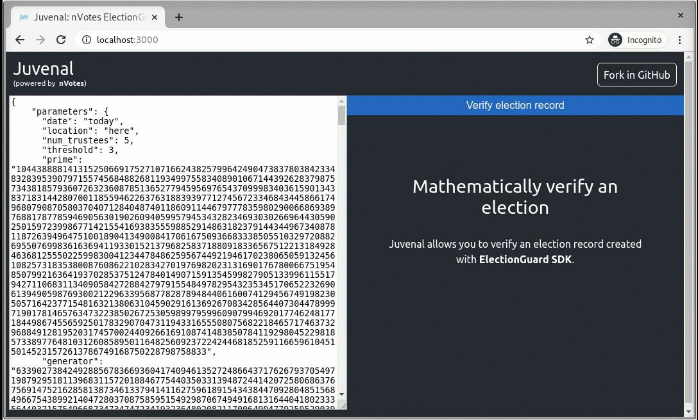

# Juvenal: The universal election verifier

[](License)
[](https://david-dm.org/nVotes/juvenal)
[](https://github.com/nVotes/juvenal/actions?query=workflow%3Abuild)
[](https://codecov.io/gh/nVotes/juvenal/)
[](https://discord.gg/dfdnFWJ)



- Demo: [https://nvotes.github.io/juvenal]
- Source code documentation: [https://nvotes.github.io/juvenal/doc]

**juvenal** is an universal election verifier for the web browser. It is voting system agnostic, and allows anyone to verify an election record  of multiple voting systems. The proofs verification is implemented in [juvenal-lib].

It enables the verification of election ballots, tallies, and proofs generated by multiple voting solutions. It has been developed independently by the [nVotes] Online Voting team and is written in TypeScript. It also includes a command line verifier. It currently only supports verifying [ElectionGuard]. Work for supporting [Helios Voting] is in the works.

**WARNING**: This software is in development and is incomplete and most probably
contains bugs. Please do not use in production..

## Building

This is a TypeScript project and uses the standard TypeScript toolchain.
Install dependencies with:

```bash
yarn
```

Then you can build the project into javascript to the `build/` directory with:

```bash
yarn build
```

## Development

In the project directory, you can run:

```bash
yarn start
```
 
Runs the app in the development mode. Open [localhost:3000] to view it in the 
browser.
 
The page will reload if you make edits. You will also see any lint errors in 
the console.

## Contribute

There are multiple ways to contribute:

- [Submit bugs] and help us verify fixes as they are checked in.
- Create [Pull Requests] implementing new features.
- Create [Pull Requests] implementing proofs verification for a verifiable voting system not yet supported.
- Review [source code changes].
- Use the [discord channel] to engage with the community.

[juvenal-lib]: https://github.com/nVotes/juvenal-lib
[nVotes]: https://nvotes.com
[ElectionGuard]: https://github.com/microsoft/electionguard
[localhost:3000]: http://localhost:3000
[https://nvotes.github.io/juvenal/doc]: https://nvotes.github.io/juvenal/doc/
[https://nvotes.github.io/juvenal]: https://nvotes.github.io/juvenal/
[discord channel]: https://discord.gg/dfdnFWJ
[Pull Requests]: https://github.com/nVotes/juvenal/pulls
[source code changes]: https://github.com/nVotesOrg/juvenal/pulls
[submit bugs]: https://github.com/nVotes/juvenal/issues
[Helios Voting]: https://heliosvoting.org/